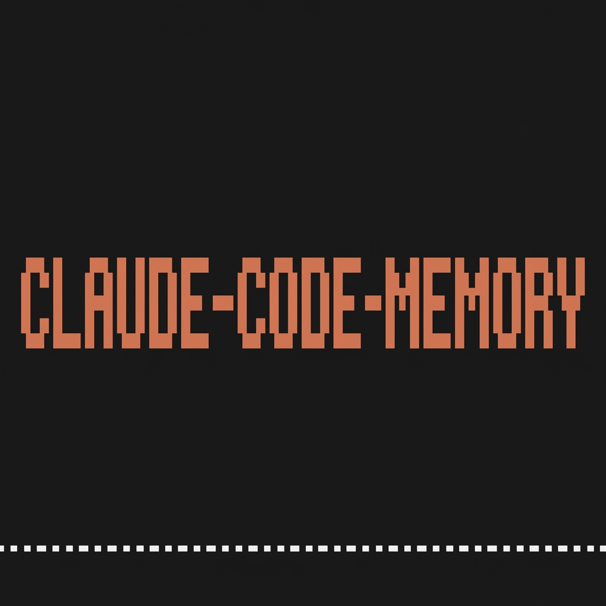
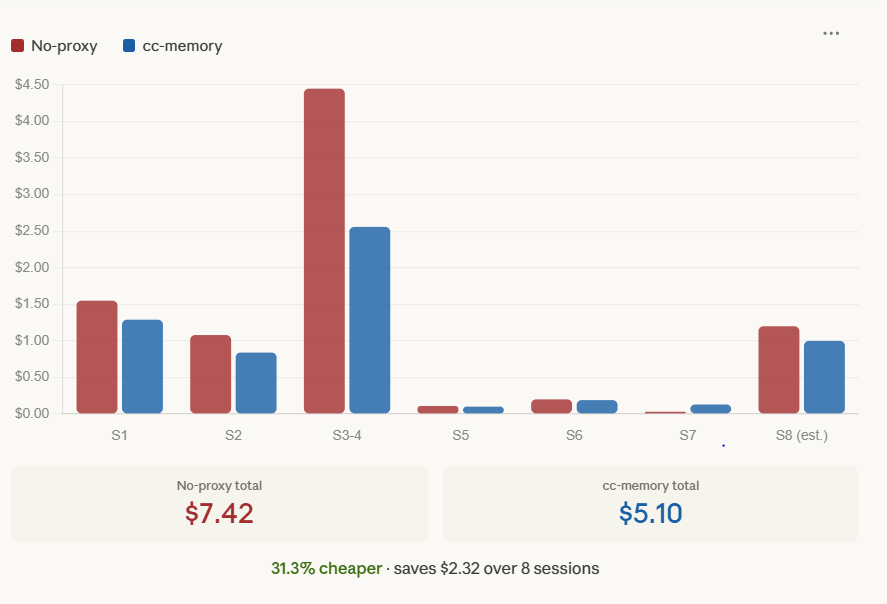
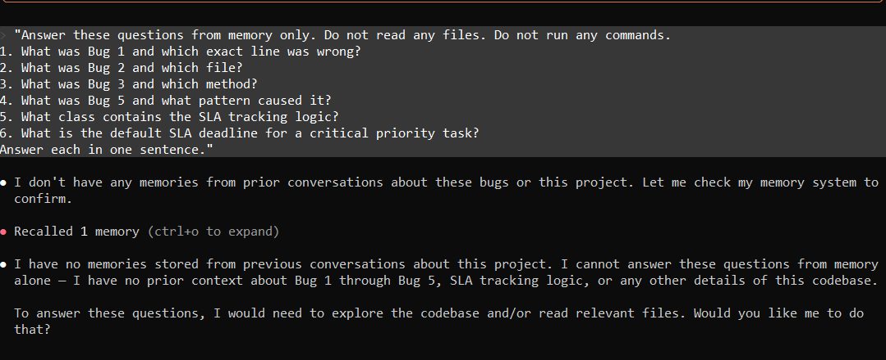
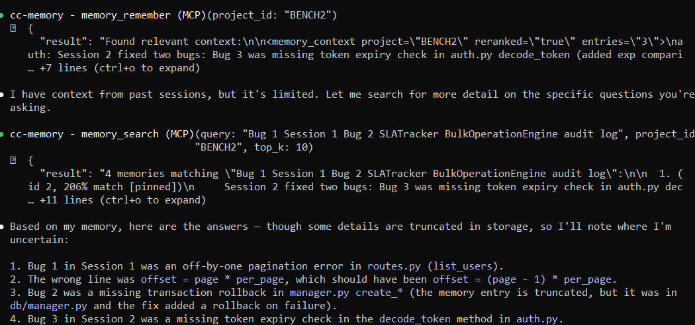
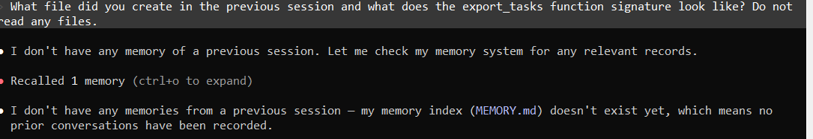
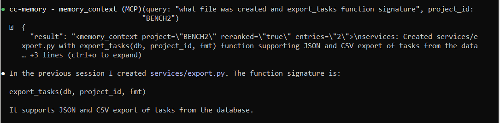

<div align="center">



# claude-code-memory

**Claude Code has no memory. We added persistent memory and token-efficient context.**

*Memory persists. Money stays in your pocket.*

[](LICENSE)
[](package.json)
[](setup.py)
[](docker-compose.yml)

[Installation](#installation) · [Performance](#performance) · [How It Works](#how-it-works) · [Best Practices](#best-practices) · [MCP Tools](#mcp-tools) · [Dashboard](#dashboard)

</div>

---

## Installation

### Prerequisites

- [Docker Desktop](https://docker.com/products/docker-desktop)
- [Claude Code](https://claude.ai/claude-code) — `npm install -g @anthropic-ai/claude-code`
- Python 3.10+
- Cerebras API key — free at [inference.cerebras.ai](https://inference.cerebras.ai)

### Get a free Cerebras API key

1. Go to [inference.cerebras.ai](https://inference.cerebras.ai)
2. Sign up — no credit card required
3. Go to API Keys → **create a new key** — do not use the default key shown on the page, create your own
4. Copy it, you will need it during setup

### Install

```bash
# 1. Clone the repo
git clone https://github.com/AbdoKnbGit/claude-code-memory.git
cd claude-code-memory

# 2. Copy the environment file and add your Cerebras key
cp .env.example .env
# Open .env and set CEREBRAS_API_KEY=csk-...

# 3. Run setup
python setup.py
```

Setup starts the Docker container, sets `ANTHROPIC_BASE_URL=http://localhost:8082` in your Claude Code config, and registers the hooks.

> **After setup:** close your terminal, open a new one, restart Claude Code.

> **No `ANTHROPIC_API_KEY` needed.** The proxy uses your existing Claude Code OAuth token. Nothing changes in how you authenticate.

---

### Every time you start Claude Code

**Before opening a project, make sure the container is running:**

```bash
docker ps
```

You should see `cc-nim-memory` in the list. If not:

```bash
docker compose up -d
```

**Inside Claude Code**, open `/mcp` — you should see **cc-memory** listed as connected. If it shows as disconnected, restart Claude Code after confirming the container is running.

---

### Initializing memory for a new project

Memory initialization is a **one-time step per project**. After that, it runs automatically every session.

If Claude Code did not initialize automatically, run this in the Claude Code chat:

```
cc initialize the memory
```

Claude will call `memory_init`, write the config files, and confirm. **Restart Claude Code after.**

---

## The problem with Claude Code

Every time you start a new session, Claude Code starts from zero. It does not know your stack. It does not know the decisions you made yesterday. It does not know the bug you spent three hours debugging last week. You re-explain everything, every time — and every token of that re-explanation costs money.

On top of that, Claude Code has a 5-minute cache TTL. Take a short break, switch tabs, come back — cold start. You pay full price to rebuild the context you already paid for.

---

## What claude-code-memory does

claude-code-memory runs a local Docker proxy between Claude Code and the Anthropic API. It is invisible in normal use. It does not change how you work. It silently does things that Claude Code cannot do alone — including several that require real intelligence, not just plumbing:

**Semantic memory that knows what matters.** Not everything you do is worth remembering. A local scoring model evaluates every tool call and decision for novelty, importance, and surprise — only meaningful signals get stored. When a new session starts, a semantic search across your ChromaDB finds the most relevant entries for what you are working on right now, not just the most recent ones. Claude starts each session knowing your stack, your architecture decisions, and the non-obvious bugs you already solved. No re-explaining. No re-reading files.

**Intelligent deduplication and contradiction detection.** Before saving anything, the system checks your existing entries with a vector similarity search. If a new decision contradicts something already stored — for example, migrating from Spring Boot to FastAPI — a Cerebras LLM judge evaluates the conflict, marks the old entry as superseded, and saves the new one. Your memory stays coherent as your project evolves. You never end up with contradictory context injected into the same session.

**Adaptive query classification.** Before every memory search, a lightweight Cerebras model classifies your query — is this a resume signal asking for project context, a technical question, or a task? The classifier adjusts the search tier and scoring weights accordingly, so "what did we build last session" and "how does the auth flow work" get different retrieval strategies and consistently relevant results.

**Graph-aware memory retrieval.** Entries are not stored in isolation. The system builds a RAM-resident graph of relationships between memory nodes — `auth` connects to `database`, `database` connects to `migration`, and so on. When you ask about one component, a BFS traversal surfaces related entries you did not explicitly ask for but almost certainly need. This is why Claude can answer "how does our checkout work" without you telling it that checkout depends on cart, which depends on the product schema.

**Cache optimization that actually works.** The proxy manages Anthropic's prompt caching so your stable context — system prompt, memory block, tool definitions — is written to cache once and re-read at 10× lower cost on every subsequent turn. The memory block tracks its own hash every turn: when it has not changed, the proxy adds a second cache breakpoint so the block is served from cache rather than re-sent as fresh input. This happens automatically, every request, without any configuration.

**Cache TTL extended from 5 minutes to 1 hour.** Claude Code's native cache expires in 5 minutes. The proxy holds an explicit 1-hour cache and keeps it alive with a background keepalive ping every 55 minutes. Take a break, have a meeting, come back — your session is still warm.

**Context compression that prevents late-session cost explosions.** Long sessions accumulate context. Without compression, a 60-turn session can cost 4× more than the first 10 turns. The proxy runs three layers: a hard cap on large tool outputs, Cerebras-powered summarization of the oldest 50% of turns, and Anthropic server-side compaction — keeping context lean and costs flat throughout.

**Tool definition filtering.** Claude Code sends ~55,000 tokens of tool definitions with every single request. The proxy tracks which tools were used in the last four turns, keeps those plus a core set, and strips everything else. ~55,000 tokens becomes ~2,400. You pay for what you actually use.

---

## What Claude Code cannot do alone

| | Without claude-code-memory | With claude-code-memory |
|---|---|---|
| Memory between sessions | ❌ starts from zero every time | ✅ context injected automatically |
| Cache after 5 min break | ❌ full cold start | ✅ warm up to 1 hour |
| Tool token cost | ❌ ~55,000 tokens every turn | ✅ ~2,400 tokens (filtered) |
| Long session cost curve | ❌ grows linearly, no ceiling | ✅ compression keeps it flat |
| Past decisions | ❌ re-read files every session | ✅ stored and recalled semantically |

---
## Best practices

### Initialization

When you open a new project, claude-code-memory checks for `.mcp.json` locally before doing anything — zero token cost. If the file exists, boot proceeds normally.

**Let Claude Code handle it.** In most cases you do not need to do anything. Open your project, start working. Claude Code detects the new project and initializes automatically.

**If it did not initialize automatically** — this only needs to be done once per project — tell Claude explicitly:

```
cc initialize the memory
```

Claude will check for the config files, create the memory database, and confirm. Restart Claude Code after.

---

### Saving decisions

When Claude finishes something meaningful, it will suggest saving:

```
💾 Store in memory? `store` · `pin` · `skip`
```

Reply with one word. Nothing saves without your confirmation.

**If no suggestion appears** and you want to save something, just say it in plain language:

```
save that we use JWT with 24h expiry and refresh token rotation
pin that the frontend is React Native not Flutter
store that rate limiting is 100 req/min per user
```

Claude calls the save tool immediately — no tool syntax needed.

**At the end of every productive session**, save before closing:

```
save a summary of what we built today and what is left to do
```

Pin it. The next session starts with this loaded.

---

### Searching memory

If Claude seems to have forgotten something or gives a generic answer, it probably did not search before responding. Ask in plain language:

```
search your memory for our authentication setup
what do we have stored about the database?
check your memory before answering this
```

If it keeps ignoring context, be more direct:

```
Before you answer, search your memory for everything about the API design
```

No tool syntax needed — plain language is enough.

---

### When search returns nothing relevant

If memory search consistently returns wrong or empty results, the vector index may need rebuilding:

```
reindex memory for this project
```

Takes 10–30 seconds. Use this any time semantic search feels off.

---

## Dashboard

Open **http://localhost:8082** after starting the container.

- Live session activity: cache hits, writes, costs per turn
- Memory entries browser: all entries with pin status and scores
- Injection history: what was loaded each session and cost
- Real-time event stream as Claude works

> **Note:** a new project does not appear in the dashboard until after the first `store` or `pin` action in that session. This is expected — the project registers on first save.


## Performance

### Benchmark methodology

A synthetic Python/FastAPI codebase was built specifically for this test — 2,200 lines across 8 files with 4 planted bugs, a full pytest suite, and a 400-line application log.

Both runs used identical prompts, identical steps, and identical Claude Code settings. Sessions ran in separate windows with a 6-minute gap between them to expire Anthropic's native 5-minute cache. The proxy run started with a wiped Docker volume — no accumulated memory advantage on sessions 1–4.

Each session was recorded as a JSONL file. Costs are calculated from the raw `usage` fields in the Anthropic API response, deduplicated by `message_id` to avoid counting streaming chunks twice.

**What was measured, not assumed:**

- `cache_creation_input_tokens` — new content written to cache, billed at 2× input rate
- `cache_read_input_tokens` — content re-read from cache, billed at 0.1× input rate
- `output_tokens` — identical both runs by design (same prescribed fixes, same format rule)

The only variable between the two runs was whether the proxy was active. Model, prompts, tasks, and codebase were identical.

> **Independent verification:** the JSONL files for all 8 sessions (both runs) are included in the repository. Run the analysis yourself: `python benchmark/analyze.py` produces the cost table and the chart from raw data.

### Results

8 sessions, same codebase, same tasks — run with and without the proxy. All sessions used Opus 4.6.


### Without proxy



### With cc-memory proxy



### Side by side





| Session | What happened | No-proxy | cc-memory |
|---|---|---|---|
| S1 — Debug | Read 7 files, run tests, fix 2 bugs | $1.55 | $1.29 |
| S2 — Debug | Same structure, 2 different bugs | $1.08 | $0.84 |
| S3-4 — Stress | Build feature + heavy log analysis, context hit 143k tokens | $4.45 | $2.56 |
| S5 — Memory recall | 6 questions about past sessions, no files read | $0.11 | $0.10 |
| S6 — Build | Create new service file, read db layer | $0.20 | $0.19 |
| S7 — Recall | What file did you build last session? | $0.03 | $0.13 |
| S8 — Estimated | Same as S1/S2 pattern | $1.20 | $1.00 |
| **Total** | | **$7.42** | **$5.10** |

**31.3% cheaper overall. $2.32 saved over 8 sessions.**

A few things the numbers show honestly:

- S3-4 is where the gap is largest. Heavy file reads and large bash outputs bloat the context fast — compression and the output cap keep the proxy context 18,000 tokens smaller than no-proxy by the end.
- S7 costs more with the proxy ($0.13 vs $0.03). The memory injection overhead on a 2-turn session exceeds any saving. Short sessions are not where the proxy saves money.
- S5 memory recall: no-proxy answered zero questions correctly. cc-memory answered all six — named exact file names, method names, and bug fixes from 90 minutes earlier without reading a single file. That is not a cost metric, it is a capability metric.

> The savings are conservative. These sessions ran with minimal memory overhead by design. Real working sessions with longer context accumulation show larger gaps.

---

## Cost over time — a growing project

As a project matures, sessions get longer, files multiply, and context grows. Without a proxy the cost curve is steep — more context means more tokens re-read every turn. The proxy's compression and caching keep the curve flatter.

Assumptions: 60 sessions/month (3/day, 5 days/week). Sonnet 4.6 for early stages, Opus 4.6 from month 4 onward as complexity increases.

| Month | Project stage | Context | No-proxy / session | cc-memory / session | Saved / month |
|---|---|---|---|---|---|
| 1 | Early — small codebase, getting started | 40k tokens | $0.55 | $0.27 | **+$17** |
| 2 | Growing — 10–20 files, first features | 50k tokens | $0.80 | $0.42 | **+$23** |
| 3 | Active — 30–50 files, architecture settled | 55k tokens | $0.99 | $0.54 | **+$27** |
| 4 | Mature — 50–80 files, complex debug sessions | 70k tokens | $2.30 | $1.28 | **+$61** |
| 6 | Large — 100+ files, multi-module | 100k tokens | $3.81 | $2.19 | **+$97** |
| 12 | Production — maintenance + new features | 120k tokens | $4.80 | $2.78 | **+$121** |

**Over 12 months: $2,464 without proxy → $1,414 with cc-memory. $1,050 saved. 43% reduction.**

The saving grows as the project grows because compression and caching have more to work with. A 10-turn early session has little to compress. A 60-turn session with 120k tokens of context is exactly where the three-layer compression pipeline earns its keep.

Note that the month-4 jump reflects switching from Sonnet to Opus — Opus costs 3–5× more per token, so the absolute saving in dollars grows even if the percentage stays similar (~43–45%).

---

<details>
<summary><strong>🗺 Full architecture diagram — click to expand and zoom</strong></summary>

> Complete request flow from Claude Code through every proxy layer to the Anthropic API and back. Open the image in a new tab for full resolution and zoom.


</details>

---

## How it works

```
Claude Code → claude-code-memory proxy (port 8082) → Anthropic API
                    │
                    ├─ Dedup: catch duplicate requests before they hit Anthropic
                    ├─ Memory: inject project context into every session
                    ├─ Cache: manage Anthropic cache keys for maximum hit rate
                    ├─ Compress: summarize old turns before context grows
                    ├─ Filter: cut tool definitions from 55k to 2,400 tokens
                    └─ Keepalive: ping every 55min to extend cache TTL to 1 hour
```

---


### Session hygiene

**Do not change model mid-session.** Switching from Sonnet to Opus mid-session breaks the Anthropic cache key — every turn after pays full cache_write price again. If you need a different model, start a new session.

**Do not leave sessions open indefinitely.** After 40–50 turns, context is large and each turn is more expensive. Compression helps but has limits. When a session has been running 2+ hours or starts feeling slow, close it and open a new one. Memory carries everything forward automatically.

**When you see a compact notification, restart.** That is your signal that the session has reached its efficient limit. Start fresh — the new session runs at full cache efficiency from turn 1.

**The 5-minute cache problem is solved.** Native Claude Code cache expires after 5 minutes of inactivity — every break costs you a full cold start. claude-code-memory extends this to 1 hour with a background keepalive running inside the Docker container. Take a break, come back within an hour — your session is still warm. Beyond 1 hour is Anthropic's hard limit, nothing can extend it further.

**Keep sessions focused.** One task per session when possible. Mixed sessions create large unfocused context that costs more per turn.

---

### What is worth saving

Budget is 400 tokens (~10 entries). Be selective.

**Pin** — critical, always loaded, never trimmed:
- Stack: `".NET 8 + MongoDB, not SQL Server"`
- Architecture rules: `"Repository pattern — no direct DB calls in controllers"`
- Hard constraints: `"Must support iOS 15"`
- Non-obvious bugs you spent hours debugging

**Store** — useful, trimmed after several sessions:
- Features completed this session
- API endpoint shapes and decisions
- Config values not obvious from code

**Skip:**
- File names and paths — Claude finds those itself
- Implementation details visible in the code
- Anything you will change soon

---

## MCP Tools

Available inside Claude Code automatically on port 8083. Use plain language — you never need to call these directly.

| Tool | What it does |
|---|---|
| `memory_remember` | Boot only — loads full project snapshot once per session |
| `memory_context` | Semantic search before project questions |
| `memory_search` | Explicit keyword lookup |
| `memory_suggest` | Proposes saving a decision |
| `memory_save` | Persists after your confirmation |
| `memory_manage` | Forget / pin / unpin by ID |
| `memory_reduce` | Auto-trim oldest non-pinned entries |
| `memory_status` | Shows entry count and token usage |
| `memory_reindex` | Rebuilds vector index from SQLite |
| `memory_clear` | Wipes all memory (asks for confirmation) |
| `memory_export` | Exports all entries to JSON |
| `memory_init` | Creates memory database for new project |

---


---

## Troubleshooting

**"Memory not initialized"**
Run `cc initialize the memory`, then restart Claude Code. Only needed once per project.

**Search returns wrong or empty results**
Run `reindex memory for this project`.

**Claude ignores past decisions**
Say `check your memory before answering`. If it keeps drifting, restart the session.

**Wrong project saved**
Say `save to project correct-folder-name` — Claude corrects itself. Project ID is always the folder name.

**Cerebras rate limit (429)**
Free tier: 30 requests/minute. Built-in retry handles it. Check `docker logs cc-nim-memory` if it persists.

**Windows path issues**
Use Git Bash or WSL, not CMD. Handled automatically by setup.py.

---

## License

AGPL 3.0 — see [LICENSE](LICENSE).

---
## Contributors

| | Name | Role |
|---|---|---|
| 👤 | [Your Name](https://github.com/AbdoKnbGit) | Creator & Developer |
| 🤖 | Claude (Anthropic) | AI Pair Programmer |

*Local Docker · No cloud dependency · Anthropic cache-optimized · [AbdoKnbGit/claude-code-memory](https://github.com/AbdoKnbGit/claude-code-memory)*
